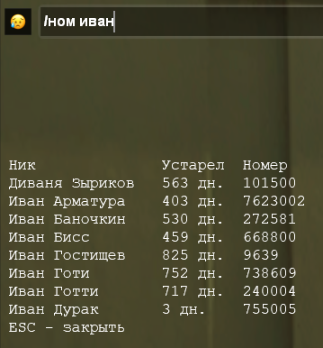

# AbsInfoBot биндер для SAMP
Приложение позволяет выводить на экран номера телефонов игроков сервера Absolute RP Platinum.  
По всем вопросам писать в телеграмм бота [https://t.me/AbsInfoBot](https://t.me/AbsInfoBot) команда `/report`  

## Команды
Пример команды для вывода номеров игроков, у которых в нике есть слово `ronny`
```
/ном ronny
.ном ronny
/num ronny
.num ronny
```
Также можно искать по номеру телефона ник игрока
```
/ном 123456
```

## Как установить

 1. Скачать из [Releases](https://github.com/RavenVSS/AbsInfoBinder/releases) AbsInfoBinderOL.exe, WinOverlay.dll и поместить в одну папку
 2. Запустить AbsInfoBinderOL.exe
 3. (если ошибка с dll) Установить [Visual C++ v14 x86](https://learn.microsoft.com/en-us/cpp/windows/latest-supported-vc-redist?view=msvc-170#latest-supported-redistributable-version)


## Настройки config.json
```json
{ 
	"overlayPositionX": 10, // Позиция по ширине от левого верхнего угла в пикселях
	"overlayPositionY": 400, // Позиция по высоте от левого верхнего угла в пикселях
	"overlayFontSize": 20, // Размер шрифта
	"maxNumbers": 8, // Максимальное количество номеров для вывода
	"createLogFile": false // Вывод логов в файл
}
```

## Source
- https://github.com/cocobelgica/AutoHotkey-JSON

- https://gist.github.com/rasoulcpu/50030f6fbbac44e24f1d62875dd7d66d

