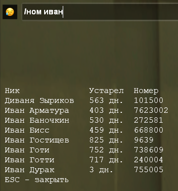
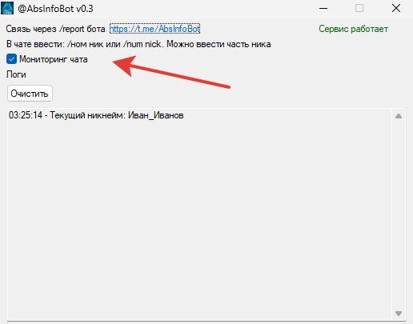

# AbsInfoBot биндер для SAMP
Биндер позволяет выводить на экран информацию по серверу Absolute RP Platinum.  

Функции биндера:
- поиск номеров
- просмотр истории ников
- мониторинг чата: при свёрнутой игре, уведомляет если вас упомянули или написали СМС  

✅ Совместимо с античитом, приложение работает поверх игры, без внедрения в работу SAMP.  

По всем вопросам писать в телеграмм бота [https://t.me/AbsInfoBot](https://t.me/AbsInfoBot) команда `/report`  

## Команды и возможности
#### Поиск номеров
Пример команды для вывода номеров игроков, у которых в нике есть слово `ronny`
```
/ном ronny
.ном ronny
/num ronny
.num ronny
```
Также можно искать по номеру телефона ник игрока
```
/ном 123456
```
#### История ников
Пример команды для вывода истории никнеймов  
⚠️Важно чтобы ник полностью совпадал!
```
/ник Ronny Madison
.ник Ronny Madison
/nick Ronny Madison
.nick Ronny Madison
```
Если ников будет слишком много, часть ников заменится на `...`
#### Мониторинг чата
⚠️Работает только с оригинальным лаунчером Absolute!  

Биндер мониторит чат когда игра свёрнута, если ваш никнейм появится в чате или вам напишут СМС - появится уведомление Windows.  

Мониторинг можно отключить, убрав галочку "Мониторинг чата".  


## Как установить

 1. Скачать из [Releases](https://github.com/RavenVSS/AbsInfoBinder/releases) AbsInfoBinder.exe
 2. Запустить AbsInfoBinder.exe
 3. (если ошибка с dll) Установить [Visual C++ v14 x86](https://learn.microsoft.com/en-us/cpp/windows/latest-supported-vc-redist?view=msvc-170#latest-supported-redistributable-version)


## Настройки config.json
```json
{ 
	"overlayPositionX": 10, // Позиция X от левого верхнего угла в пикселях
	"overlayPositionY": 400, // Позиция Y от левого верхнего угла в пикселях
	"overlayFontSize": 20, // Размер шрифта
	"maxNumbers": 8, // Максимальное количество номеров для вывода
	"createLogFile": true, // Вывод логов в файл
	"chatlogMonitoring": false // Мониторинг чата
}
```

## Source
- https://github.com/cocobelgica/AutoHotkey-JSON

- https://gist.github.com/rasoulcpu/50030f6fbbac44e24f1d62875dd7d66d
